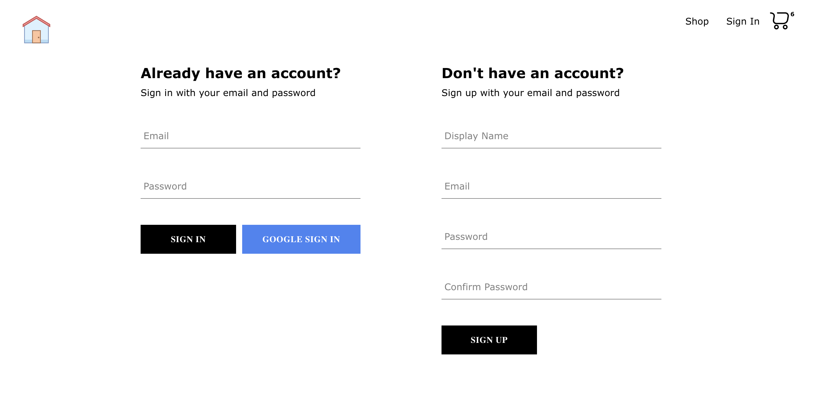
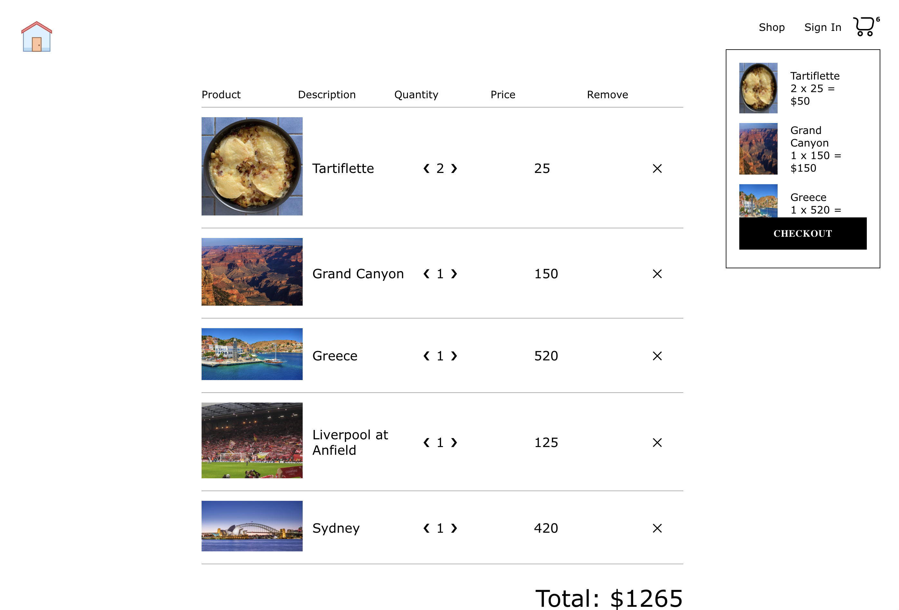

## 

### This online store displays various personal interests as options for purchase. By navigating the site, you can add the items that interest you to the cart and explore the functionality as well as my personal interests!

  <!-- short description -->

<b>Getting Started</b>:

Welcome to my online store! This guide will help you get started using my website. It is hosted at https://magnificent-gaufre-911888.netlify.app; however, the website is marked by Google as dangerous due to the existence of my sign in/sign up page. If you would like, you can still access the website by ignoring Google's warning. It is not necessary to sign in to access the rest of the website's functionality. Alternatively, follow the steps below to locally host the application.

<i>Feel free to sign up with a fake email and password that you <b>DO NOT USE NORMALLY</b> if you would like to test the sign up and sign in features</i>

## Quick Start:

<b>Steps:</b>

1. Clone the repo and run npm install

2. run npm dev for local hosting

## Current Features

- Sign in and Sign up with email or via a Google account
- Dynamic Routing
- A functional shopping cart
- A checkout page which enables easy cart updating
- Fully functional backend hosted by Firebase
- Redux thunks

## Iteration Plans

- Stripe payments (in Stripe's test environment)
- Individual webpages for each product/item with additional information and links

## Connect with me!

